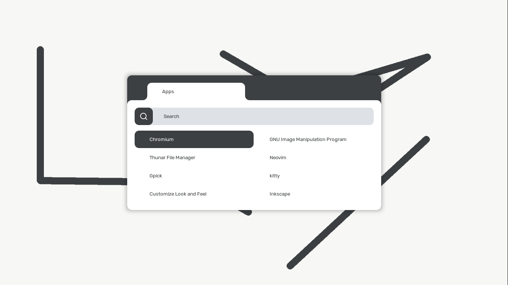
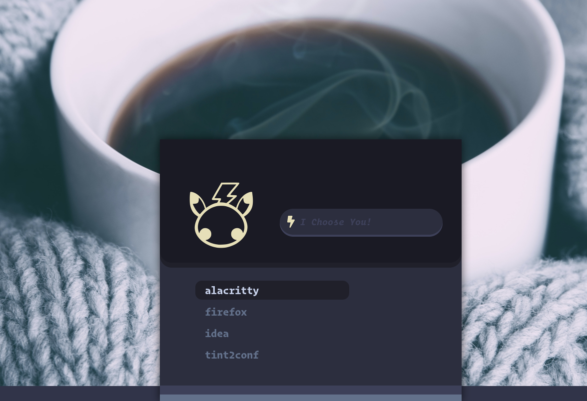

<h1 align="center" >rofi</h1>

Quick collection of a few rofi configs I have created.

## Installation

Clone this repo
```git clone https://github.com/joni22u/rofi-themes```. 
Then copy  the contents of folders into ```~/.config/rofi/```.

Example

`cp rofi-themes/default/* ~/.config/rofi/`

## Screenshots

Default

</img>

Carbonized

</img>

Cherry

</img>

Glassy

</img>

Print

</img>

Pfp

</img>

Chromium

</img>

Pikachu

</img>
